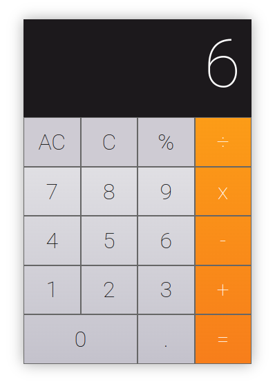

# Mini Proyecto de Calculadora en JavaScript

## Descripción

Pequeño proyecto de calculadora simple creado con JavaScript. Es un proyecto creado con fines educativos para practicar la manipulación dinámica del DOM y la manipulación de datos con JavaScript. 

## Funcionalidad

La calculadora permite a los usuarios realizar operaciones básicas como sumar, restar, multiplicar, dividir y calcular porcentajes. Los números y los operadores se pueden seleccionar utilizando los botones interactivos en la interfaz de la calculadora. Los usuarios también tienen la opción de borrar el último número ingresado o limpiar toda la pantalla.

## Prueba la calculadora

Para probar la calculadora, simplemente ve a la página de demostración alojada en GitHub Pages haciendo click en el siguiente enlace:

* https://pablospata.github.io/calculator-js/